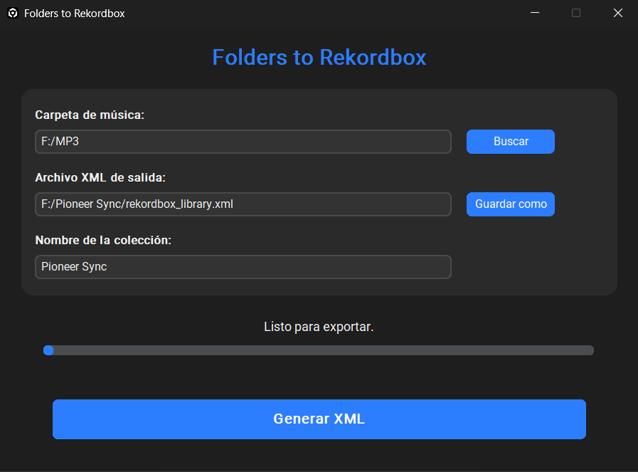

# Folders to Rekordbox



Folders to Rekordbox generates a rekordbox 7 import XML from your music folder structure.

It scans a root music directory, mirrors the folder hierarchy into playlists, and exports an XML file that rekordbox can import so it can continue with analysis, waveform generation, artwork handling, and metadata processing.

## Features

- Mirrors folder structure into rekordbox playlists
- Preserves nested folder hierarchy
- Reads basic audio metadata with `tinytag`
- Exports a rekordbox-compatible XML file
- Includes a dark UI with automatic language detection on Windows

## Requirements

- Python 3.11+ for development builds
- Windows, macOS Intel, or macOS Apple Silicon for native builds
- `pyinstaller` for packaging

## Run from source

```bash
cd Pioneer_Sync
python -m pip install -r requirements.txt
python folders_to_rekordbox_app.py
```

## Build instructions

### Windows

```bat
cd Pioneer_Sync
build_windows.bat
```

### macOS

```bash
cd Pioneer_Sync
bash build_macos.sh
```

## GitHub Actions releases

The repository includes a workflow at:

`.github/workflows/folders_to_rekordbox.yml`

It builds:
- Windows `.exe`
- macOS Intel `.app`
- macOS Apple Silicon `.app`

Trigger it manually or push a tag matching:

```text
folders-v*
```

## Repository layout

```text
Pioneer_Sync/
  folders_to_rekordbox.py
  folders_to_rekordbox_app.py
  build_windows.bat
  build_macos.sh
  rekordbox.ico
  rekordbox.webp
  app.png
```

## License

This project is released under the MIT License. See `LICENSE`.

